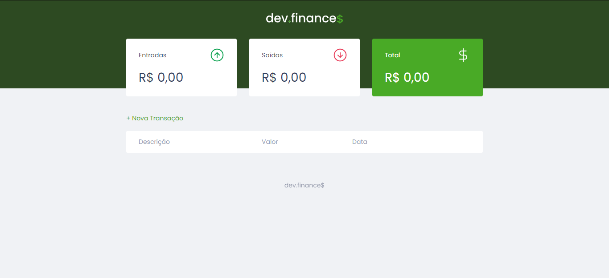
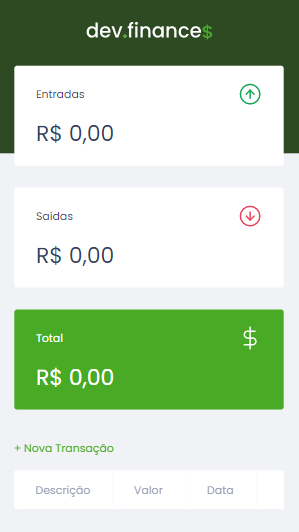

# dev-finances
Projeto desenvolvido na Maratona Discover da Rocketseat, com o objetivo de registrar entradas e saídas de dinheiro para monitoramento de gastos.
## Instalação
Basta fazer um clone do repositório e executar o arquivo "index.html".
## Desktop

## Mobile

## Tecnologias
- HTML
- CSS
- Javascript
